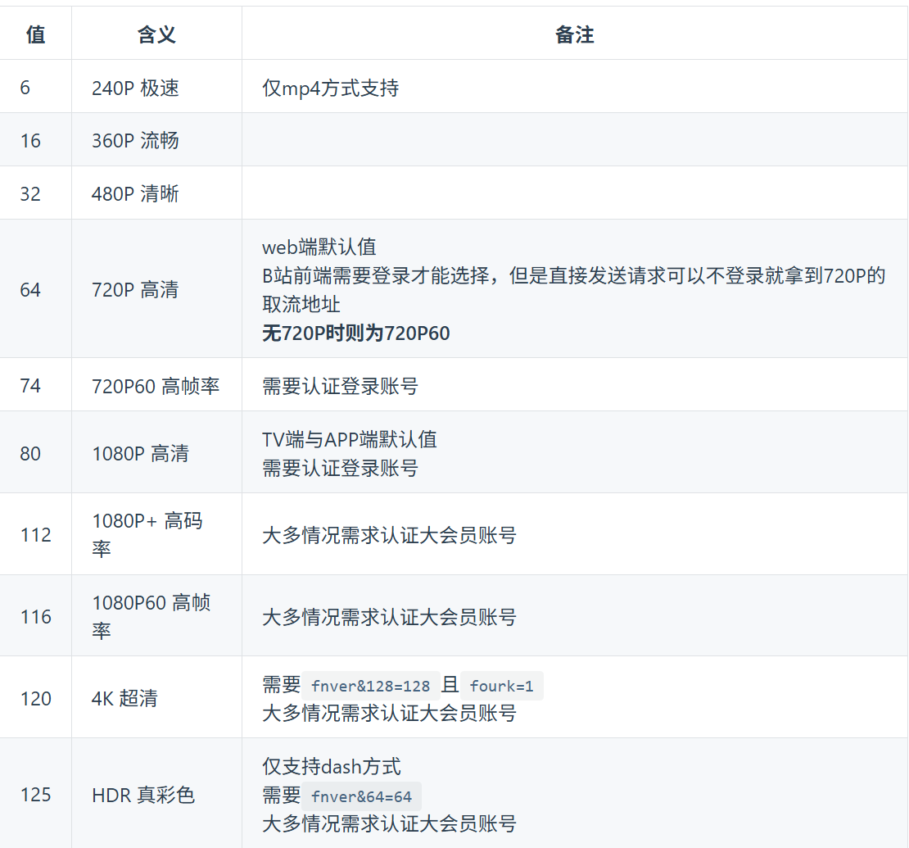

# 🎬 BilibiliDownload 帮助文档

## 📖 项目简介
BilibiliDownload 是一个用于搜索和下载B站视频的Python工具🔧。它提供了两种方式获取视频信息（搜索页面解析和官方API），并支持高质量视频下载⬇️。

---

## ✨ 功能特性

### 1. 🔍 视频搜索功能
- **关键词搜索**：根据关键词搜索B站视频
- **两种搜索方式**：
  - `search`：通过解析搜索结果页面获取视频信息
  - `api`：通过B站官方API获取结构化数据
- **📄 分页支持**：支持多页搜索结果获取
- **🔢 排序选项**：支持多种排序方式

### 2. ⬇️ 视频下载功能
- **BV号下载**：通过BV号直接下载视频
- **🎨 多清晰度支持**：可指定视频质量
- **🔄 断点续传**：支持大文件分块下载
- **📊 进度显示**：实时显示下载进度
- **🛡️ 重试机制**：网络异常时自动重试

---

## 🚀 快速开始

### 📥 安装依赖

```bash
pip install requests pyquery loguru tqdm
```

### ⚙️ 配置文件
项目需要 `config.py` 文件，包含请求头信息：
```python
# 请求头可以根据，自己的要求来修改
HEADERS = {
    "User-Agent": "Mozilla/5.0 (Windows NT 10.0; Win64; x64) AppleWebKit/537.36",
    "Referer": "https://www.bilibili.com/"
}
```

---

## 🎯 使用方法

### 1. 🔎 搜索视频并获取BV号

**使用搜索页面方式：**
```bash
python bilibilidownload.py --fetchBV --method search --key "搜索关键词" --page 1 --save True
```

**使用API方式：**
```bash
python bilibilidownload.py --fetchBV --method api --key "原神" --page 1 --order "click" --save True --filename "result.json"
```

### 2. ⬇️ 下载视频

**通过BV号下载：**
```bash
python bilibilidownload.py --BV "BV1xxx" --quality 80 --savedir "./videos" --videoname "我的视频.mp4"
```

---

## 📋 参数详解

### 🔍 搜索相关参数
| 参数 | 简写 | 说明 | 默认值 |
|------|------|------|--------|
| `--fetchBV` | `-fb` | 🎯 启用BV号获取模式 | - |
| `--key` | `-k` | 🔤 搜索关键词 | "原神" |
| `--method` | `-m` | 🛠️ 搜索方式：`search` 或 `api` | - |
| `--page` | `-p` | 📄 页码 | 1 |
| `--order` | `-o` | 🔢 排序方式 | "default" |
| `--save` | `-s` | 💾 是否保存JSON结果 | False |
| `--filename` | `-fn` | 📁 保存JSON的文件名 | None |

### ⬇️ 下载相关参数
| 参数 | 简写 | 说明 | 默认值 |
|------|------|------|--------|
| `--BV` | `-bv` | 🆔 要下载的视频BV号 | - |
| `--maxretries` | `-mt` | 🔄 最大重试次数 | 3 |
| `--quality` | `-q` | 🎨 视频清晰度 | 0 |
| `--savedir` | `-sd` | 📁 视频保存目录 | "./downloads" |
| `--videoname` | `-vn` | 📹 视频文件名（包含后缀） | None |

---

## 📁 输出文件结构

项目运行后会生成以下目录结构：

```
项目根目录/
├── 📄 BV/                 # 搜索页面方式获取的BV号JSON文件
├── 📊 API/               # API方式获取的视频信息JSON文件
├── 🔍 information/       # 视频元数据信息
├── ⬇️ downloads/         # 下载的视频文件
└── 🐍 bilibilidownload.py
```

---

## 🎨 清晰度参数参考



### 1.部分参照值

| 参数值 | 清晰度 | 说明 |
|--------|--------|------|
| `0` | 🎯 自动选择 | 系统自动选择最佳清晰度 |
| `80` | 🔥 1080P | 高清画质 |
| `64` | 👍 720P | 标准高清 |
| `32` | 📱 480P | 清晰画质 |
| `16` | ⚡ 360P | 流畅画质 |

`对于清晰度的选择，一般是选择0`

---

## ⚠️ 注意事项

1. **🌐 代理设置**：代码中默认设置了本地代理（127.0.0.1:7890），如不需要请修改 `proxies = None`，`建议将proxies修改为None，在代理的情况下，视频会下载的特别慢，可能会出现下载失败的想象`
2. **📝 文件命名**：视频标题可能包含特殊字符，程序会自动处理文件名
3. **📶 网络要求**：需要稳定的网络连接访问B站API
4. **📜 遵守规则**：请遵守B站的使用条款，不要大量频繁请求
5. **💾 存储空间**：确保有足够的磁盘空间存储视频文件

---

## 🛠️ 错误处理

- ❌ 网络请求失败会自动重试
- 📛 文件名非法时会使用时间戳重命名
- 🔧 API返回错误时会显示具体错误信息
- ⏸️ 下载中断后可重新执行命令继续下载
- 📊 支持详细的日志记录，便于排查问题

---

## 🎪 实用示例

### 🔍 搜索示例
**搜索并保存原神相关视频信息：**
```bash
python bilibilidownload.py -fb -m api -k "原神" -p 3 -s True
```
**输出：** ✅ 将在 `API/` 目录生成包含视频信息的JSON文件

### ⬇️ 下载示例
**下载指定BV号的视频：**
```bash
python bilibilidownload.py -bv "BV1TAnozgEpe" -q -sd -vn
```
**输出：** ✅ 视频将保存到 `./my_videos/教程视频.mp4`

### 🔄 组合使用
```bash
# 1. 先搜索获取BV号
python bilibilidownload.py -fb -m api -k "Python教程" -s True

# 2. 从生成的JSON中复制BV号进行下载
python bilibilidownload.py -bv "BV1xxx" -q 64
```

---

## 🎊 使用技巧

- 💡 使用 `api` 方式获取的信息更结构化
- 🎯 清晰度参数 `0` 通常能获得最佳观看体验
- 📊 使用 `--save True` 保存搜索结果便于后续批量下载
- 🔧 如遇网络问题，可调整代理设置或重试次数

---

---

## 🙅‍♀️代码缺陷

- ❌目前还是无法直接通过网页获取的方式来获取BV码

---

---

## ⌛️待完成实现

- [ ] 完成从网页获取BV号的方式，同时完善指令逻辑

---

这个工具可以帮助你快速搜索和下载B站视频，适用于视频备份、素材收集等合法用途。🎯 享受使用的乐趣！